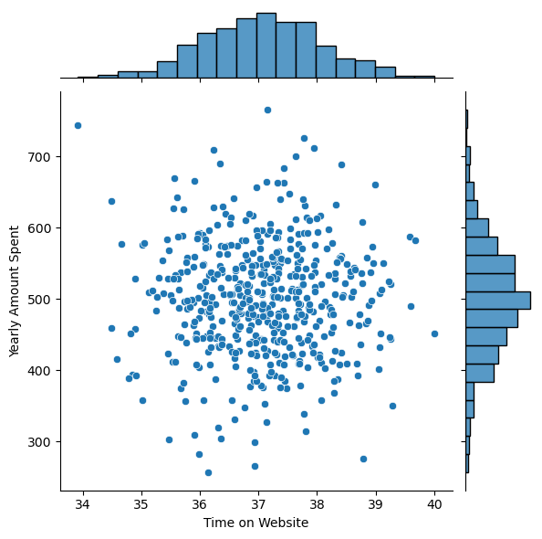
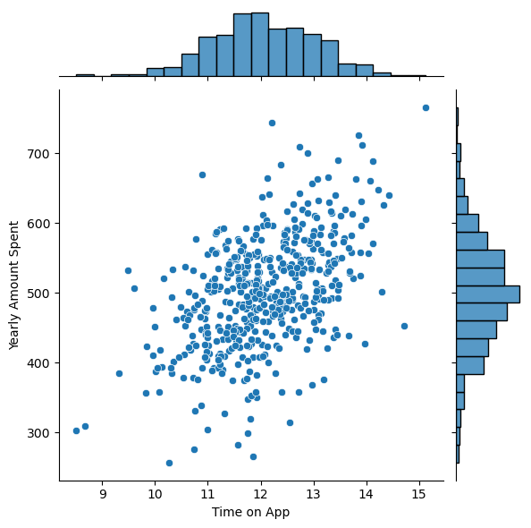
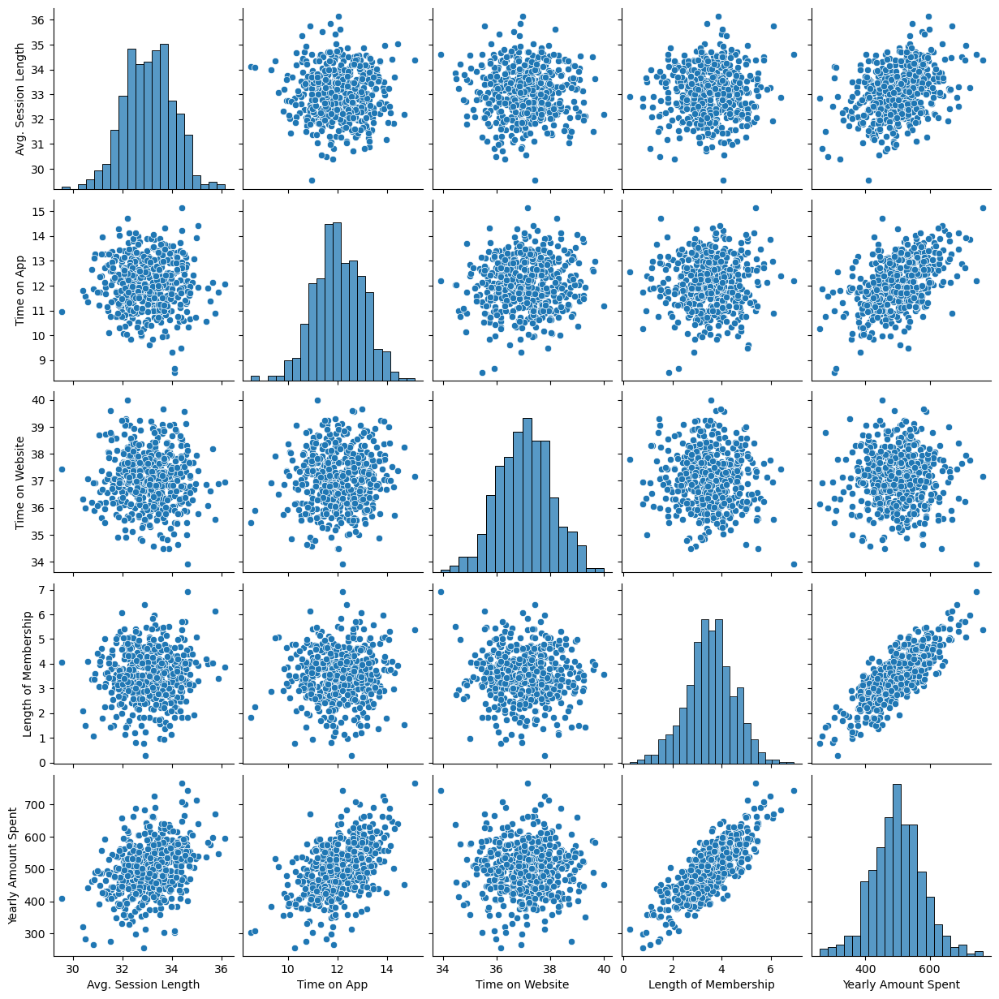
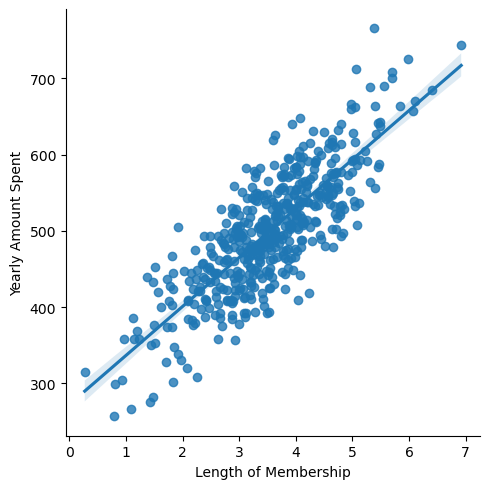
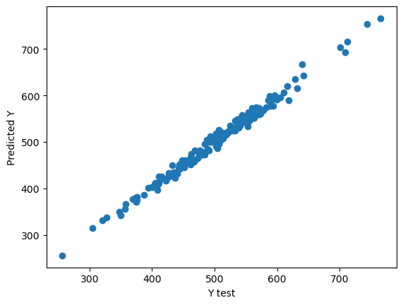

# Projeto de Regressão Linear Ecommerce

## Dados
Os dados são fictícios e o download feio da Kaggle.

* Avg. Session Length: Tempo médio das sessões de consultoria de estilo na loja.
* Time on App: tempo médio gasto no app em minutos.
* Time on Website: tempo médio gasto no site em minutos.
* Lenght of Membership: Há quantos anos o cliente é membro.
* Yearly Amount Spent: Valor Anual Gasto.

## Análise exploratória

Primeira etapa foi entender se o tempo do cliente no site do ecommerce tinha alguma relação com o valor anual gasto por ele.
Conforme a imagem abaixo é possível ver que o tempo no site não tem relação com o valor anual gasto.

Agora se analisar o tempo gasto no APP em relação com o valor anual gasto, podemos perceber que existe uma relação linear.

Vendo que existe uma relação nessas informações, fiz uma análise similar, porém com todos os dados.

Como podemos ver na imagem acima, existe uma relação muito forte e perceptivel entre Valor Anual Gasto (Yearly Amount Spent) e Há quantos anos o cliente é membro (Lenght of Membership).
Na imagem abaixo, podemos ver com mais clareza essa informação.

## Modelo de regressão linear com machine learning

Criei um modelo de regressão linear utilizando a biblioteca do Python scikit-learn.
Essa biblioteca possui diversos modelos de machine learn e utilizei o modelo de regressão linear.
Após treinar o modelo tive uma predição dos dados muito boa e sem erros conforme a imagem abaixo.

## Conclusão

Com o modelo já preparado tive os seguintes resultados dos coeficientes:
##

|    | Coefs |
| ------------- | ------------- |
| Avg. Session Length  | 25.981550  |
| Time on App  | 38.590159  |
|Time on Website  | 0.190405  |
| Length of Membership | 61.279097  |

##

Temos as seguintes informações retiradas do modelo:

A cada unidade de há quantos anos o cliente é membro (Lenght of Membership), tempo médio gasto no app em minutos (Time on App), tempo no site (Time on Website) e tempo médio das sessões de consultoria de estilo na loja (Session Length), aumenta em X dólares no valor Anual Gasto (Yearly Amount Spent).

Um exemplo é a cada minuto no APP, se tem um acréscimo de 38.59 dólares no valor anual. Ou a cada ano em que o cliente é membro do site, aumenta em 61.27 dólares no valor anual.
