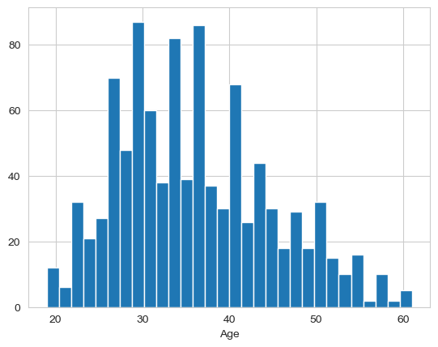
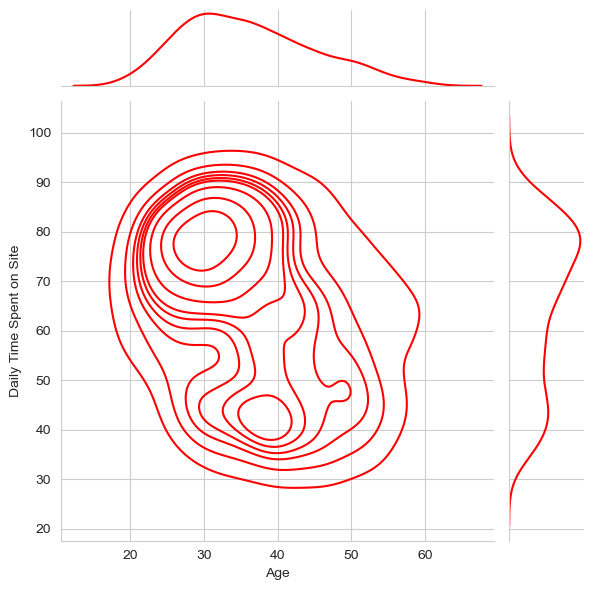
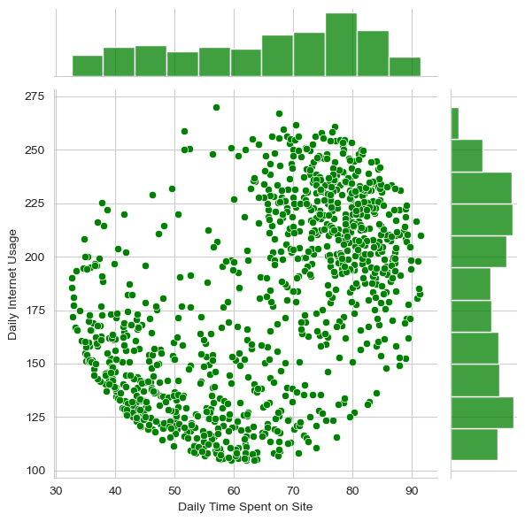
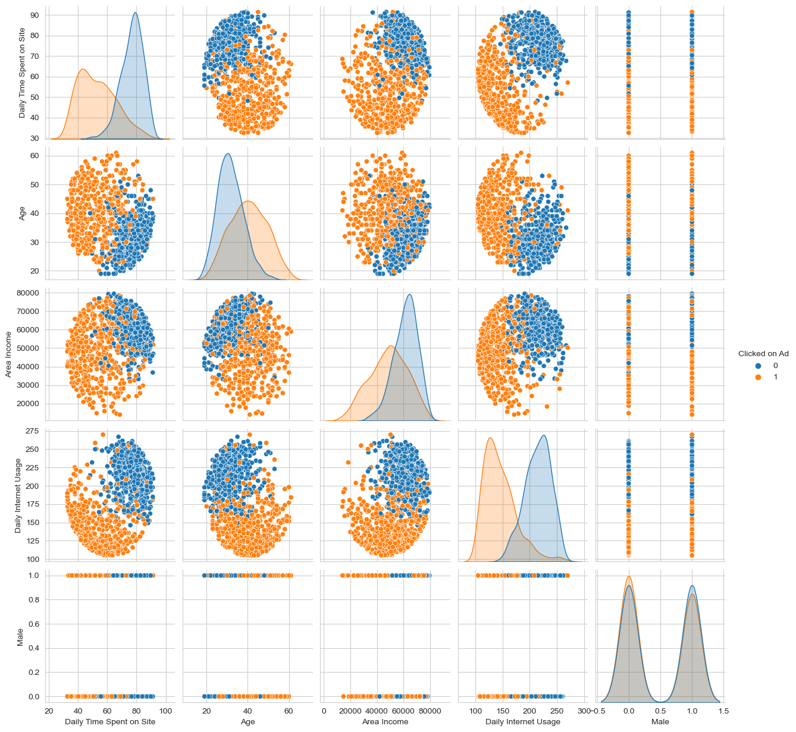
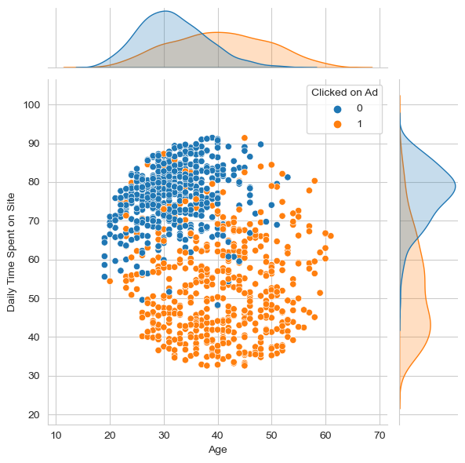

# Projeto de Regressão logística 

Neste projeto foi realizada uma análise em um conjunto de dados de um site.

A ideia e compreender se o cliente clicou ou não em um anuncio e prever através de uma regressão logística.

## Dados
Os dados são fictícios e o download feio da Kaggle.

* 'Daily Time Spent on Site': tempo no site em minutos.
* 'Age': idade do consumidor.
* 'Area Income': Média da renda do consumidor na região.
* 'Daily Internet Usage': Média em minutos por dia que o consumidor está na internet.
* 'Linha do tópico do anúncio': Título do anúncio.
* 'City': Cidade do consumidor.
* 'Male': Se o consumidor era ou não masculino.
* 'Country': País do consumidor.
* 'Timestamp': hora em que o consumidor clicou no anúncio ou janela fechada.
* 'Clicked on Ad'': 0 ou 1 indicam se clicou ou não no anúncio.

## Análise exploratória

A primeira etapa foi entender os nossos dados e comecei analisando a idade do consumidor.
Na imagem abaixo podemos ver que a idade dos consumidores ficar entre 25 a 40 anos.

Foi realizada uma analise de distribuição KDE (Kernel Density Estimation é uma técnica utilizada na análise espacial cartográfica para estimar a densidade de pontos em uma área geográfica.)

Podemos ver conforme a imagem abaixo, que as pessoas de 30 anos ficam em média de 80 minutos no site.

Analisei também o tempo em que o consumidor fica na internet versus o tempo que ele fica no site. Assim tentamos ver se existe alguma relação entre as duas informações.

As informações que podemos retirar é que se formaram 2 cluesters, onde as pessoas que ficam mais tempo na internet também ficam mais tempo no site e que as pessoas ficam menos tempo no site, também ficam menos tempo na internet.

Agora realizei uma analise com todas as informações do conjunto de dados e segmentei entre as pessoas que clicaram ou não no anuncio, obtive os seguintes resultados abaixo.

Podemos ver algumas relações no conjunto de dados, alguns clusters se formaram e podemos tirar algumas informações como: pessoas que possuem mais idade e ficam pouco tempo no site tem uma maior probabilidade de clicar no anuncio, conforme a imagem abaixo.

## Modelo de regressão logística com machine learning

Criei um modelo de regressão logística utilizando a biblioteca do Python scikit-learn.
Essa biblioteca possui diversos modelos de machine learn e utilizei o modelo de regressão logística.
Após treinar o modelo tive uma predição dos dados muito boa e sem erros.

## Conclusão

Com o modelo já preparado tive os seguintes resultados dos coeficientes:
##

                    precision    recall  f1-score   support

           0           0.86      0.96      0.91       162
           1           0.96      0.85      0.90       168

    accuracy                               0.91       330
    macro avg          0.91      0.91      0.91       330
    weighted avg       0.91      0.91      0.91       330

##

Com esses resultados podemos ver uma precisão de 0.91 ou 91% de certeza ondem é possível saber se ao entrar no site a pessoa vai clicar ou não no anuncio. e isso é uma informação extremamente relevante nos dias atuais.

