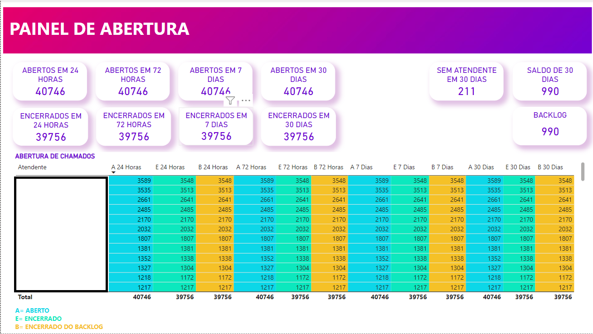
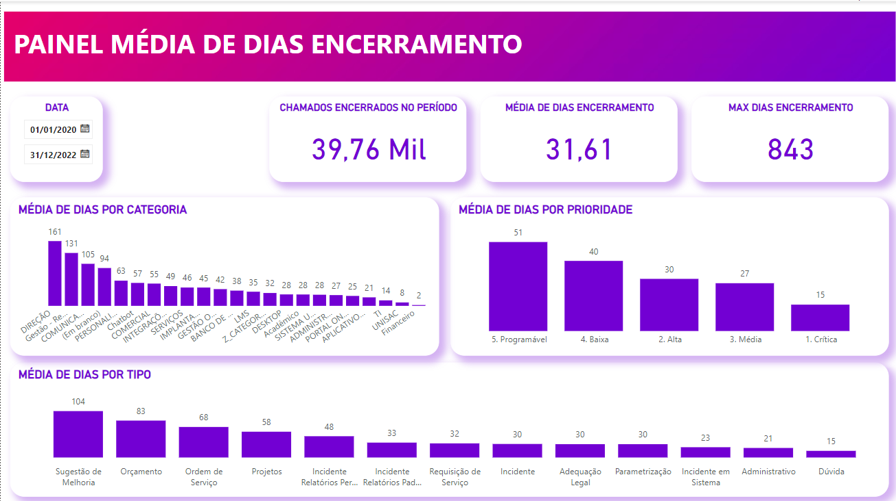
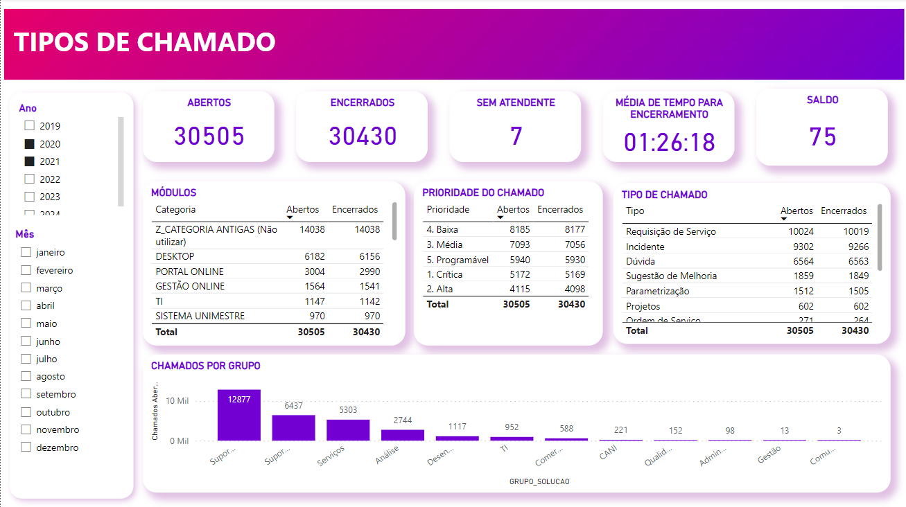
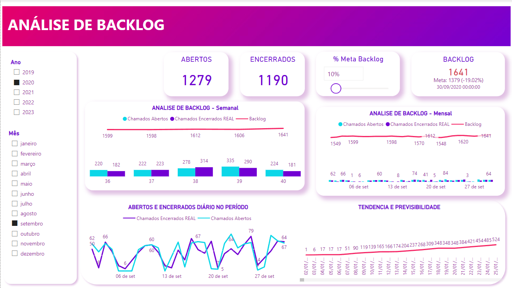
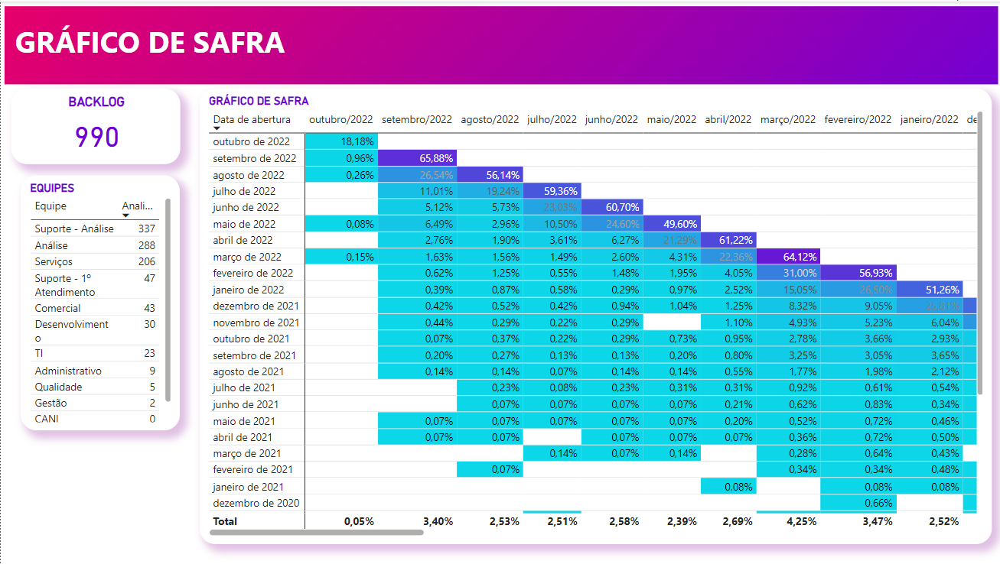

# Analise de atendimento ao cliente para empresa de TI

Esse projeto foi desenvolvido para uma empresa de TI e tem como funcionalidade analisar os dados de atendimento ao cliente e abertura de chamados/atendimentos/tickes.

## Dashboard

#### Primeira tela
Disponibiliza uma visão de todos os chamados que foram abertos e encerrados nos períodos.

#### Segunda tela
Uma visão de chamados encerrados no período e a média de encerramento,
média de chamados por tipo e prioridade.

#### Terceira tela
Uma visão de chamados abertos e encerrados no período e a média de encerramento,
média de chamados por tipo e prioridade.

#### Quarta tela
Painel com os chamados em backlog e meta de fechamento.

#### Quinta tela
Gráfico de safra do backlog.

