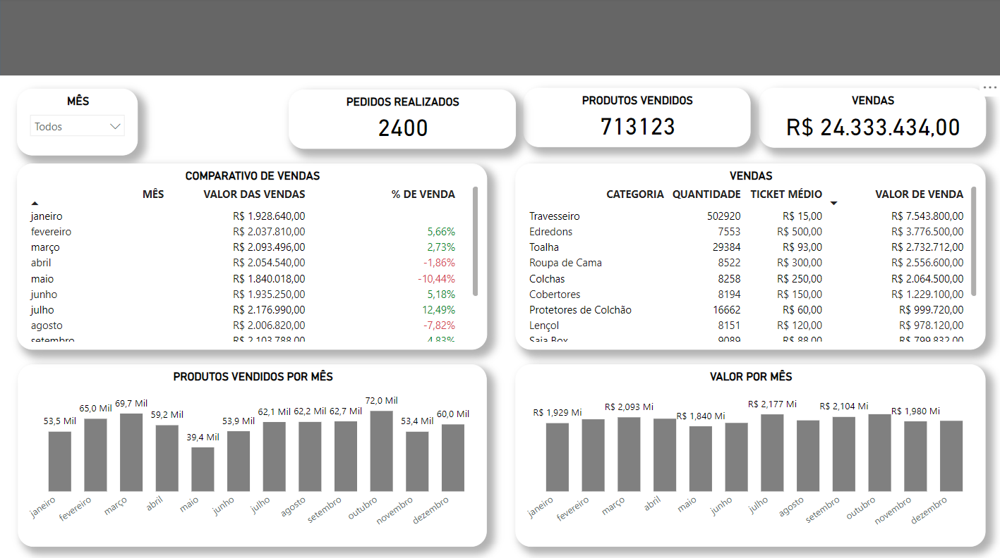
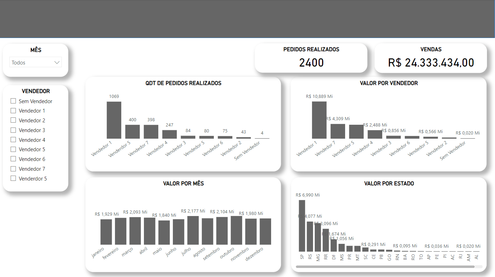
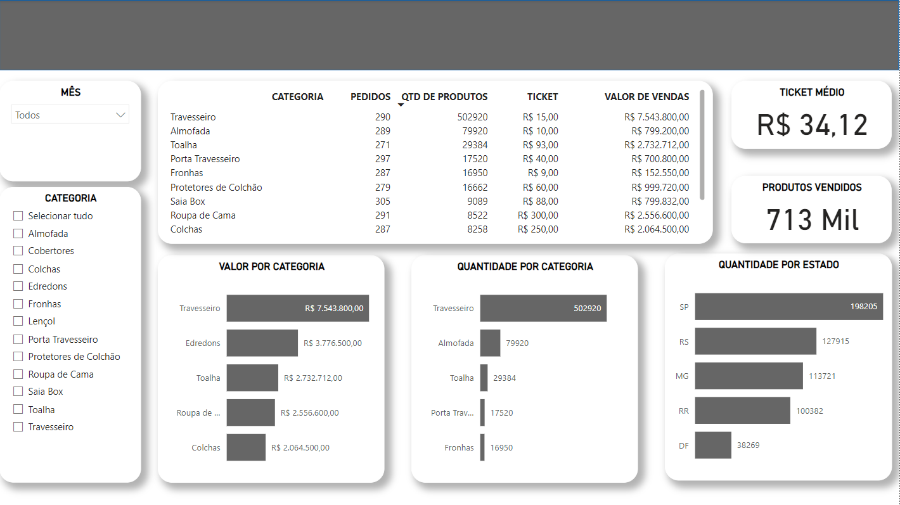
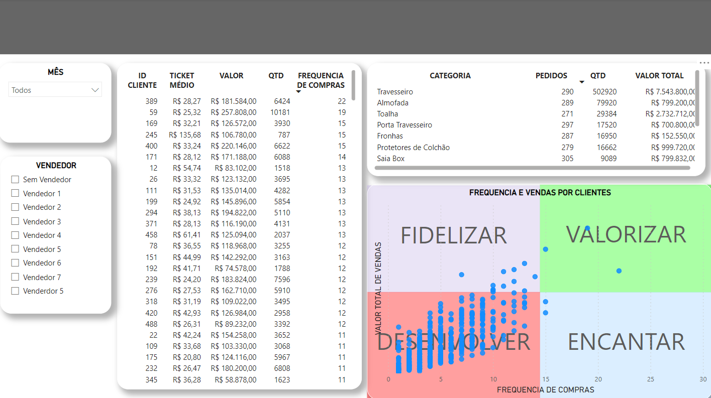

# Análise comercial empresa textil

Projeto desenvolvido para a análise de dados comerciais de uma empresa textil da região de Blumenau.

## Dados

Os dados foram disponibilizados e alterados para atender as demandas da LGPD.

## Dashboard

#### Primeira tela
Disponibiliza as principais informações de vendas e valores.

#### Segunda tela
Disponibiliza as principais informações dos vendedores.

#### Terceira tela
Disponibiliza as principais informações dos produtos.

#### Quarta tela
Disponibiliza as principais informações dos clientes.

