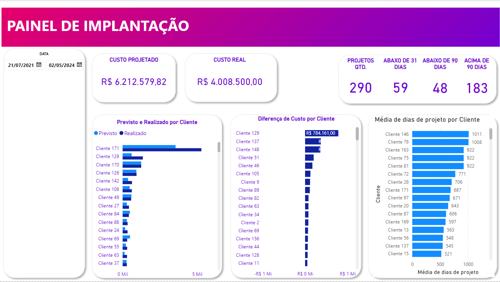

# Analise de  projetos para uma empresa de TI (ERP)

Projeto foi desenvolvido para uma empresa de TI, onde é comercializado um sistema de ERP.
O projeto envolve descobrir os custos de implantação dos projetos, tempo e os projetos com a maior defasagem.

## Dados

Os dados foram disponibilizados e alterados para atender as demandas da LGPD.

## Dashboard

#### Primeira tela
Disponibiliza as principais informações de valores dos projetos em andamento na empresa com o custo previsto e realizado.
Tambem é possivel verificar quais projetos estão atrasados ou não.

